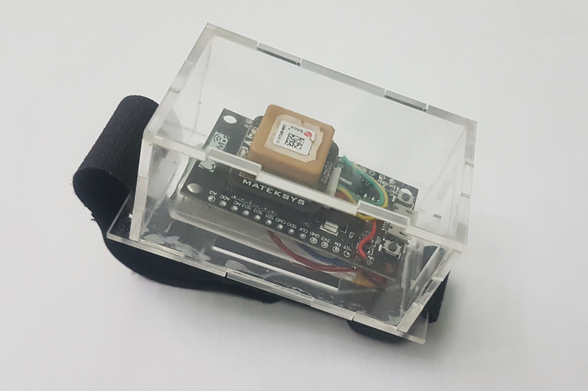
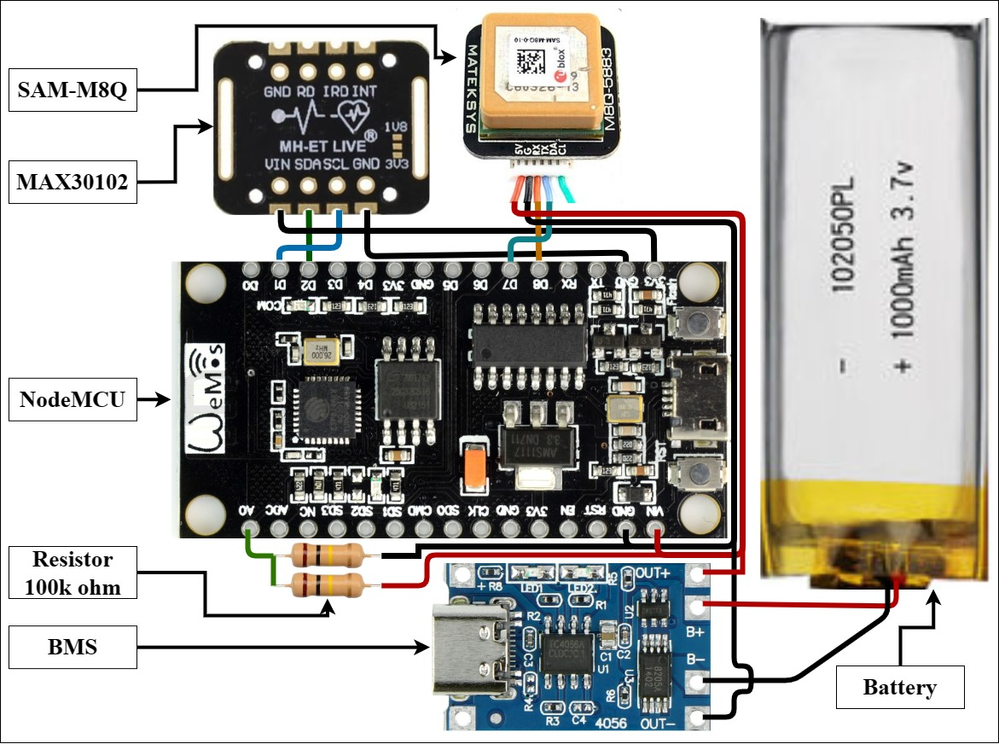

# Tracing-Covid-ESP8266
Tracing patient using SAM-M8Q GPS modul and using MAX30102 for heart rate monitoring.  
this device will send data to Firebase, [app](https://github.com/hafidhh/Patient-Surveillance-APPS) will display the data and show a notification if someone leaves the Geofencing zone (Quarantine zone).

## Device

## Component
1. [NodeMCU ESP8266](https://www.nodemcu.com/index_en.html)
2. Battery
3. Battery Management System (Charger)
4. Resistor 100KΩ
5. GPS Module ([SAM-M8Q](http://www.mateksys.com/?portfolio=m8q-5883))
6. Heart Rate Sensor ([MAX30102](https://datasheets.maximintegrated.com/en/ds/MAX30102.pdf))

## Wiring

## References
- https://www.nodemcu.com/index_en.html  
- http://www.mateksys.com/?portfolio=m8q-5883
- https://datasheets.maximintegrated.com/en/ds/MAX30102.pdf